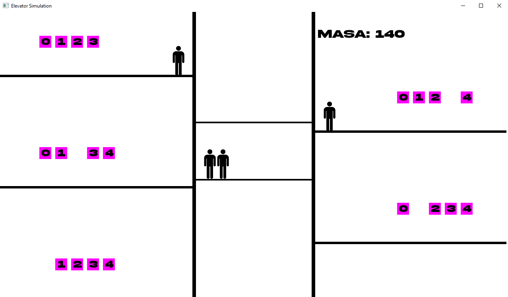

#  4 Projekt Techniki Programowania - symulator windy

***Biblioteki***
- SFML - do wyświetlania grafiki

***Opis***

Mieliśmy za zadanie stworzyć symulator windy, zachowującej się jak relistyczna. Windę można przywoływać przyciskami na konkretne piętra, nie można przekroczyć maksymalnego udźwigu 600kg, po 5 sekundach bez requestów winda zjeżdża na parter. Stworzyliśmy także prosty interfejs użytkowanika, na którym widąć obecną masę pasażerów w wnidzie.

***Jak uruchomić***
1. Sklonować lub pobrać projekt na komputer
2. Zkompiluj program używając Makefile (komenda `make lub mingw32-make`, w folderze z projektem)
3. Uruchomić powstały program .exe

***Struktura programu***
- main() - główna funkcja programu, znajduje się w niej pętla programu
- klasa Elevator - odpowiada za poruszanie się i logikę windy
- klasa Floor - reprezentuje poszczególe piętra, zawiera pasażerów oraz przyciski do wzywania windy
- klasa Passenger - reprezentuje pojedynczego pasażera, zawiera jego pozycję oraz trasę
- klasa Button - reprezentuje napisany przez nas przycisk

***Błędy w programie***
- Aplikacja napotka nieoczekiwane błędy i zakończa działanie przez wycieki pamięci. Po licznych próbach naprawy, które poprawiły działanie aplikacji, w dalszym ciągu aplikacja niespodzeiwanie przestaje działać.
- Okazjonalnie pasażerowie opuszczają windę nie zatrzymując jej, przez co latają w powietrzu.
- Z powodu implementacji funkcji rozpoznawającej obecne piętro windy, pasażerowie mogą wsiąść do niej niezależnie czy winda stoii czy się rusza.

